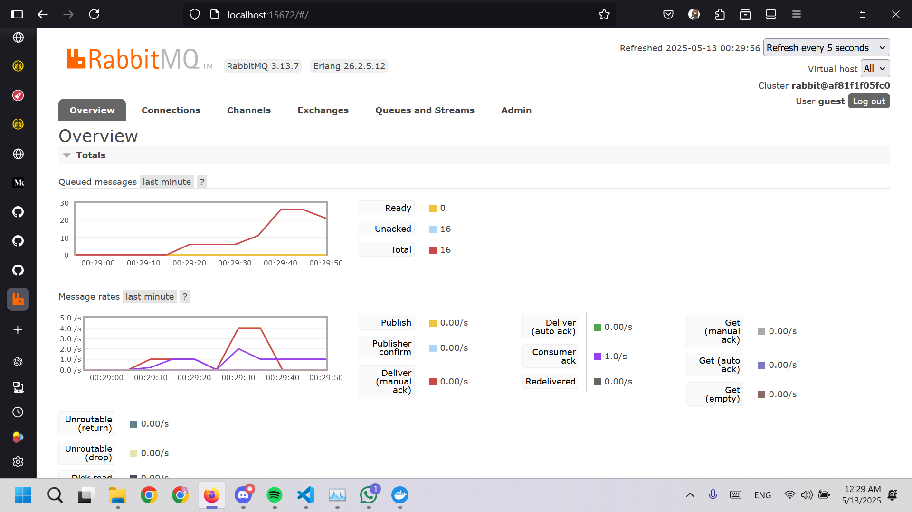
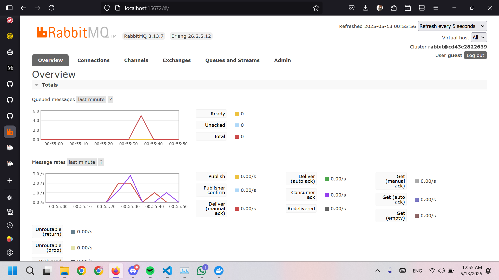
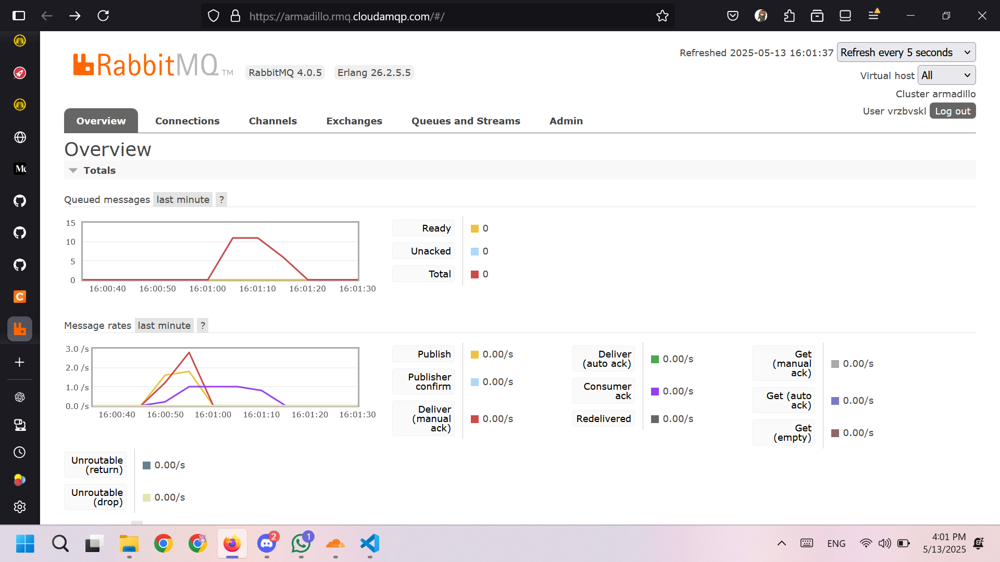

# Tutorial 9
**Nama:**   Joshua Montolalu 
**NPM:**    2306275746 
**Kelas:**  Pengjut A 

## Modul 9
### Reflection 1
1. What is ***amqp***?
    -  AMQP adalah singkatan untuk Advanced Message Queuing Protocol, yaitu sebuah protokol untuk *message-oriented middleware*. AMQP berisi beberapa ketentuan mengenai *messaging provider* dan *client* yang salah satu tujuannya adalah menjamin bahwa implementasi yang berbeda-beda dapat saling berinteraksi dan berkomunikasi dengan aman dan konsisten. Dengan kata lain, aplikasi-aplikasi yang mengimplementasi protokol AMQP dapat saling berkomunikasi dan beroperasi, terlepas dari bahasa pemrograman yang digunakan. RabbitMQ merupakan salah satu *message broker* yang mengimplementasi protokol ini; contoh-contoh lainnya adalah Apache Qpid, Apache ActiveMQ, IBM MQ, dan lain-lain. 

2.  What does it mean? `guest:guest@localhost:5672`, what is the first `guest`, and what is the second `guest`, and what is `localhost:5672` is for?
    - `guest:guest@localhost:5672` adalah URL koneksi untuk menyambung ke RabbitMQ. `guest` pertama adalah username dari user yang ingin login, sementara `guest` kedua adalah password dari user yang ingin login. Keduanya bernilai `guest` secara default dan dapat berubah-ubah sesuai dengan user yang ingin menyambung ke RabbitMQ. `localhost:5672` adalah alamat dari instance RabbitMQ yang ingin dituju, dalam kasus ini kita ingin menyambung ke RabbitMQ yang berjalan pada komputer kita sendiri (localhost) pada port 5672.

### Reflection 2 (Simulating slow subcriber)

- Terlihat pada graf pertama (graf di atas), terdapat lonjakan yang menunjukkan jumlah pesan yang tersimpan di dalam queue mengalami kenaikan. Ini terjadi karena *publisher* mengirim pesan lebih cepat daripada di-*consume* oleh *subscriber* (yang sengaja diberi *delay* untuk mensimulasikan *subscriber* yang lambat), sehingga pesan-pesan yang belum dapat diproses disimpan terlebih dahulu di dalam queue untuk kemudian di-*consume* oleh *subscriber* satu per satu. Saya menjalankan *publisher* sekitar 5 kali sehingga ada sekitar 25 pesan yang tersimpan di dalam queue.

### Reflection 3 (Running at least 3 subscribers)

- Ketika kita menjalankan lebih daru satu *subscriber*, dapat dilihat bahwa pesan-pesan dari *publisher* tersebar di antara semua *instance* *subscriber*. Ini menunjukkan bahwa kita dapat mempercepat waktu pemrosesan dengan menjalankan banyak *subscriber* secara parallel. *Message broker* pun akan memastikan bahwa setiap pesan hanya akan di-*consume* dan diproses oleh satu *subscriber*.  

- Akibat dari adanya banyak *subscriber* adalah graf *queued messages* yang sebelumnya mengalami lonjakan yang cukup lama sekarang hanya mengalami lonjakan yang singkat. *Throughput* dari *consumer* juga lebih menyerupai *throughput* dari *producer*. Hal ini terjadi karena kita memiliki lebih banyak *subscriber* yang dapat memproses pesan dari *publisher*. Oleh karena itu, walaupun setiap *consumer* sekarang lebih lambat, adanya 3 *instance* *consumer* membantu meningkatkan jumlah pesan yang dapat diproses dalam satu waktu. Akhirnya, hal ini juga membantu mengurangi jumlah pesan yang tertahan di dalam queue. Untuk hal yang dapat diperbaiki dari kode *publisher* dan *subscriber*, mungkin URL yang digunakan untuk melakukan koneksi dapat disembunyikan di dalam variabel env agar tidak dapat diakses oleh orang lain.

## Modul 9 (Bonus)
### Reflection 4 (Simulating slow subscriber)

- Sama seperti sebelumnya, terlihat pada graf pertama bahwa terdapat lonjakan yang menunjukkan jumlah pesan yang tersimpan di dalam queue mengalami kenaikan. Ini terjadi karena *publisher* mengirim pesan lebih cepat daripada di-*consume* oleh *subscriber* (yang sengaja diberi *delay* untuk mensimulasikan *subscriber* yang lambat), sehingga pesan-pesan yang belum dapat diproses disimpan terlebih dahulu di dalam queue untuk kemudian di-*consume* oleh *subscriber* satu per satu. Kali ini saya menjalankan *publisher* sekitar 3 kali sehingga ada sekitar 11-12 pesan yang tersimpan di dalam queue.